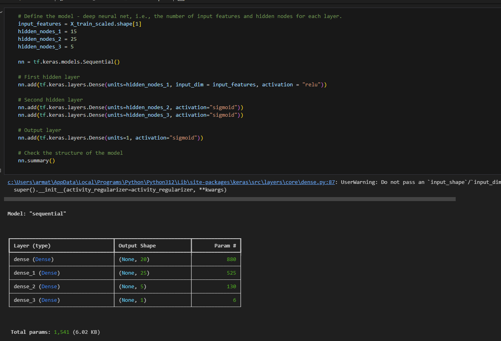

# Neural Network Model Report

## Overview

This analysis was done for a non-profit organization, Alphabet Soup, who requested a tool to help it select funding applicants with the best chance of success. They provided a dataset with information on 34,000+ organizations that was used to create a binary classifier using a tensorflow neural network model. The dataset provided information on application type, affiliation, classification, use-case, organization, status, income, amount of money requested, special considerations and a determination if the money was used effectively or not. 

The anaylsis involved dropping unnecessary identification columns, pre-processing using standard-scaler, encoding categorical variables, and creating training and data subsets. The model is then formatted, trained and evaluated on loss and accuracy. After initial evaluation, the model is optimized by adjusting inputs, adding/removing neurons and hidden layers, and changing the amount of epochs, with the ultimate goal of achieving 75% predictive accuracy. 

## Results

### Data Preprocessing

* The target variable was the "Is Successful" column, which determined if the money was used successfully.
* The feature variables were all of the other columns besides "Is Successful"
* The "EIN" column was removed from the dataset, as it didn't represent a feature or target, rather an identification number. Initially, the "NAME" column was also removed, as it is more of an identifier, but after extensive testing, it was found that keeping this column improved the models accuracy. 

### Compiling, Training, and Evaluating the Model

* In every output layer set, the neuron units were 1, and the activation layer used was sigmoid. The cutoff values remained constant with every attempt. In the first attempt of the neural network model, 15 (relu), 25 (sigmoid), and 5 (sigmoid) were used, to see how the model performed. 

Predictive accuracy was 73.3%. The loss was 0.549. 

In the second optimization attempt, I used 50 (relu), 75 (relu), and 40 (relu) units respectively. The models predictive ability on the test data, based on the training data, did not indicate overtraining. By trying more neurons, I hoped that the model would perform better. I also wanted to try the relu activation function to further optimize.

The model did not perform any better with these modifications, with accuracy of 73.3% and loss of 0.554. I do not believe that the relu activation function is the most optimal.

In the third attempt at optimization, I changed the 2nd and 3rd hidden layer to be sigmoid, instead of relu. Some research suggested this was better for binary classification. 

The model performance was very similar to the last 2 attempts. 

In the final attempt, the "NAME" column was included into the features, as I had done many minor optimizations in the first 3 attempts, and modifying the bins was not a solution that made a difference in increasing the accuracy to 75%+. The amount of neurons were much less, comparable to the first attempt. The number of parameters in the first layer increased exponentially, which was interesting.

With the training data, the accuracy was 95%+, nearly perfect! The accuracy with the test data was 76%, which definitely indicated overtraining, but with this modification the ending accuracy was over 75%. 

## Summary

The neural network model was able to achieve 76% accuracy in the end, after extensive optimization attempts. Adding neurons, hidden layers, changing feature values, changing binning values and trying different activation functions. Within each attempt were multiple attempts at slight optimization, and some non-recorded attempts at changing bin values were not successful either. 

A Random Forest model, or SVM model could be effective in solving a problem like this. They could potentially be better at solving a classification problem like this, without the need for so much optimization. They could also be better at handling outliers, which could be present within this dataset. Overall, I think these different models could be worth exploring, to achieve better predictive accuracy than 76%. 